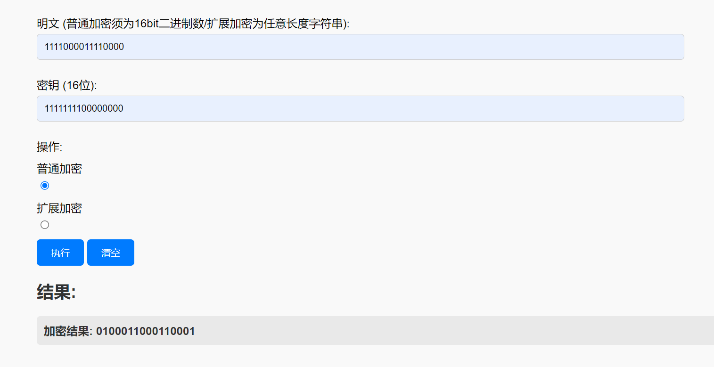
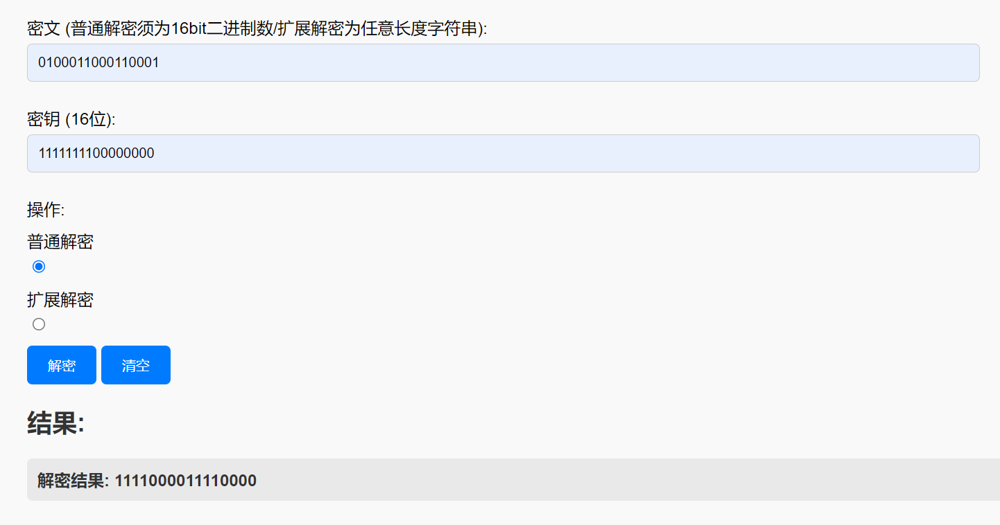
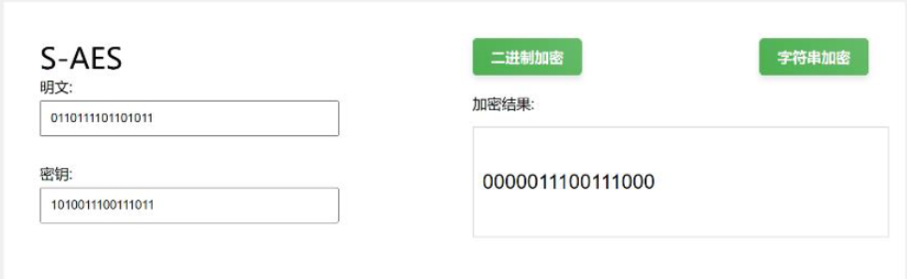
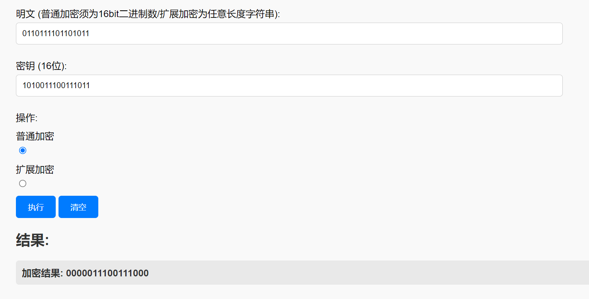

# Simple-AES Algorithm
This project implements the Simple-AES algorithm.The algorithm flow is shown in the following figure：
<!-- 算法流程图片 -->


## Table of Contents


## Introduction
This project implements the S-AES encryption and decryption algorithm, which can encrypt a 16-bit binary plaintext and a key to produce a ciphertext by inputting them; at the same time, this project also supports encrypting and decrypting any length of character string plaintext (converted to ASCII code); the project also supports multiple encryption and decryption methods, such as double encryption and triple encryption; the project also implements a method to break the cipher by means of a meet-in-the-middle attack, which requires inputting any pair of plaintext and ciphertext; the project also implements encrypting longer plaintext messages in CBC (cipher block chaining) mode.

## Dependencies
The following technologies are used in this project:
- Front-end: HTML5 + CSS3 + JavaScript
- Back-end: Node.js

## Installation
In order to set up the project well, you need to make sure to install the dependencies required for the project. Run the following command on the terminal:
```
npm install
```

## Run
Enter the following command to run the project：
```
nodemon app.js
```
At this point, the project's backend server has started, and we can now open index.html in a browser to access the project's web page.

## Project Structure
The structure of the project is shown below：
- `node_modules`: The project's dependency packages
- `public/`: Front-end files
    - `index.html`: Client web page
    - `index.css`: Stylesheets for the project, defining the visual appearance.
    - `main.js`: JavaScript files that provide interactivity and dynamic features.
    - `allKeys.html`: A page that displays all keys
- `route-handle/AES/`: Provides a handler for routes
    - `AES.js`: Contains the primary implementations of algorithms.
    - `service.js`: Provides utility functions commonly used in the project.
    - `constant.js`: Stores constant values used throughout the application.
- `routes`: Provides interface services for clients to access servers
    - `AES.js`: Provides an interface for client AES encryption and decryption requests
- `package.json`: Records the dependencies installed by the project
- `package-lock.json`: Records the dependencies installed by the project
- `app.js`: The main application file that initializes the Flask app, handles routing, and serves as the entry point for
  the application.
- `README.md`: Provides an overview of the project.

## Report
The following figure shows the main interface of the client:
<br>
<br>

### The first pass
Write and debug programs according to S-AES algorithm, provide GUI decryption to support user interaction. The input can be 16bit data and 16bit key, and the output can be 16bit ciphertext.
- The encryption result is shown in the following figure:
  
- Some of the encryption results are shown in the table below：

| PlainText        | Key              | CipherText       |
|------------------|------------------|------------------|
| 1111000011110000 | 1111111100000000 | 0100011000110001 |
| 1111000011111111 | 1111111100000000 | 0011011000110100 |
| 1111000011110000 | 1010101010101010 | 0011000100100011 |
| 0101010101010101 | 1010101010101010 | 1000101010010110 |
| 0101010101010101 | 1111111111111111 | 1111101011101110 |

- The decryption result is shown in the following figure:
  
- Some of the decryption results are shown in the table below:

| CipherText       | Key              | PlainText        |
|------------------|------------------|------------------|
| 1111000011110000 | 1111111100000000 | 1111000011110000 |
| 0011000100100011 | 1010101010101010 | 1111000011110000 |
| 1111101011101110 | 1111111111111111 | 0101010101010101 |
| 0000111100001111 | 1111000011110000 | 0011110100110101 |
| 1111111111111111 | 1111000011110000 | 1010010010011010 |

#### The second Pass
Considering the "algorithm standard", everyone needs to use the same algorithm flow and transformation unit (replacement box, column confusion matrix, etc.) when writing the program to ensure that the algorithm and the program can run properly on heterogeneous systems or platforms.
There are two groups of A and B students (select the same key K); Then the program written by the students of group A and B encrypts the plaintext P to obtain the same ciphertext C; Or Group B students receive ciphertext C encrypted by group A program, and use Group B program to decrypt it to get the same P as A.

- The encryption results of Group A students are shown below：
  
- The encryption results of Group B students are shown below：
  

The results showed that the students in group A and Group B had the same results


–žµ’ùiÀ¦"óTséÎÆm¨/ì
Æa± sǀE ze.*ÝeË´i¢le


